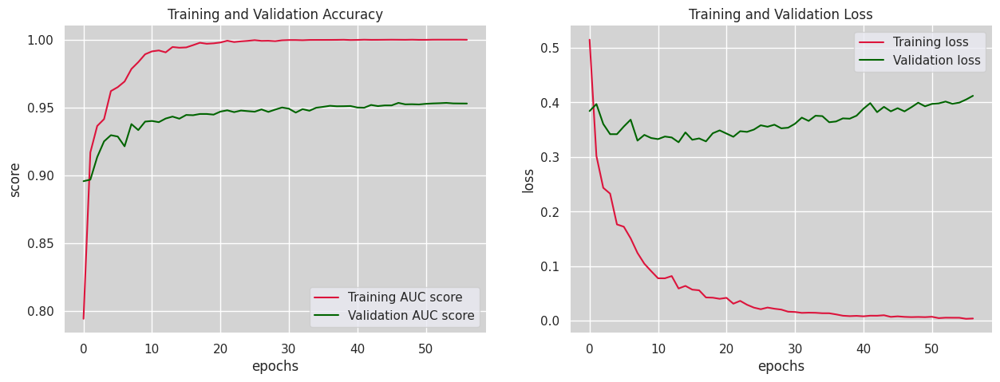
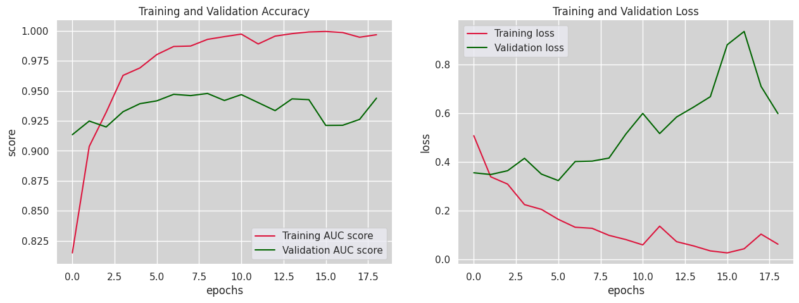
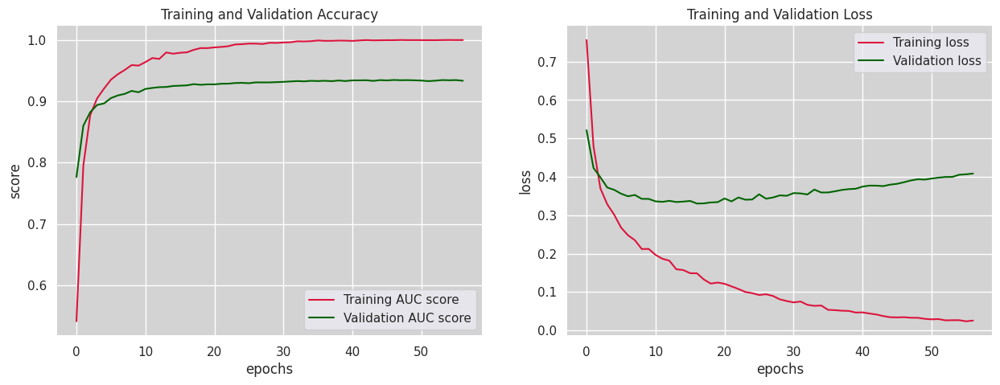
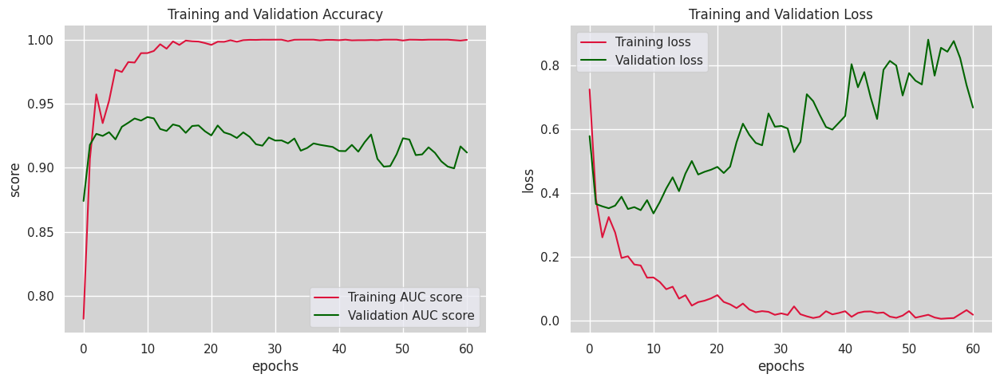

# Détection du cancer du sein sur images échographiques

Comparaison de la **supervision complète** et de la **supervision faible** pour la classification d'images échographiques mammaires, à partir de réseaux convolutifs pré-entraînés : VGG19, ResNet50 et MobileNet.

La question posée est pratique. Annoter une échographie pixel par pixel mobilise un radiologue ; une étiquette au niveau de l'image coûte une fraction de ce temps. Jusqu'où peut-on descendre en qualité d'annotation sans perdre la détection ?

## Résultats

Score AUC en validation, relevé sur les courbes d'entraînement des notebooks.

| Modèle | Supervision | AUC validation | Comportement observé |
| --- | --- | --- | --- |
| **ResNet50** | complète | **≈ 0,953** | le plus stable, perte de validation presque plate sur 55 époques |
| VGG19 | complète | ≈ 0,945 | perte de validation qui décroche dès la cinquième époque |
| MobileNet | complète | ≈ 0,933 | convergence rapide, mais plafond plus bas |

La supervision complète l'emporte, ResNet50 en tête.

Un point mérite d'être dit clairement : les trois modèles atteignent 1,0 en entraînement alors que la validation plafonne sous 0,96. Le surapprentissage est franc. La marge de progression est donc du côté de la régularisation et de l'augmentation de données, pas de la capacité du réseau.

### ResNet50 — supervision complète



Le meilleur compromis : la validation monte jusqu'à 0,953 et la perte reste stable, sans le décrochage visible sur les deux autres.

### VGG19 — supervision complète



L'AUC de validation est proche de ResNet50, mais la perte de validation remonte nettement après la cinquième époque — le modèle mémorise.

### MobileNet — supervision complète



Convergence la plus rapide, plafond le plus bas. Le compromis attendu d'une architecture légère.

### Supervision faible



Entraînement sur étiquettes au niveau de l'image, sans annotation pixel par pixel.

## Méthode

1. **Préparation** — constitution du jeu d'échographies mammaires, uniformisation des dimensions et normalisation.
2. **Transfert d'apprentissage** — trois dorsales pré-entraînées sur ImageNet, tête de classification réentraînée.
3. **Deux régimes de supervision** — annotations complètes d'un côté, étiquettes au niveau de l'image de l'autre.
4. **Entraînement** — arrêt anticipé sur la perte de validation, augmentation par `ImageDataGenerator`.
5. **Évaluation** — AUC, précision, rappel et rapport de classification sur un jeu de validation disjoint.

## Contenu du dépôt

| Fichier | Rôle |
| --- | --- |
| `FSL_resnet50.ipynb` | Supervision complète, ResNet50 — le modèle retenu |
| `FSL_vgg19.ipynb` | Supervision complète, VGG19 |
| `FSL_mobilenet.ipynb` | Supervision complète, MobileNet |
| `WSL_resnet50_and_mobilenet.ipynb` | Supervision faible sur les deux dorsales |
| `assets/` | Figures extraites des notebooks |

## Exécution

Les notebooks tournent sous TensorFlow / Keras avec scikit-learn pour les métriques.

```bash
pip install tensorflow scikit-learn matplotlib pandas numpy
jupyter notebook FSL_resnet50.ipynb
```

Le chemin du jeu de données est à renseigner dans la cellule de chargement.

## Suites possibles

Le surapprentissage constaté oriente le travail : régularisation plus sévère, augmentation plus agressive, et validation croisée plutôt qu'un simple jeu de validation. Les approches semi-supervisées et auto-supervisées restent la piste la plus intéressante pour réduire encore la dépendance à l'annotation.
